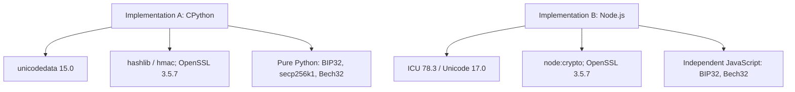

# Corey Phillips puzzle: oracle independence analysis

## Implementations

Implementation A is `tools/corey_oracle.py`, executed with CPython 3.12.13.
It uses only the Python standard library. NFKD comes from `unicodedata`
(Unicode database 15.0.0); PBKDF2, HMAC and hashes come through `hashlib` and
`hmac`; BIP32, secp256k1 point arithmetic, convertbits and Bech32 are written in
the file itself. The runtime is linked to OpenSSL 3.5.7.

Implementation B is `tools/corey_oracle_b.js`, executed with Node.js 24.19.0.
It uses no npm dependencies. NFKD comes from JavaScript `String.normalize`
(ICU 78.3, Unicode 17.0); PBKDF2, HMAC, hashes and secp256k1 public-key
generation come from `node:crypto`; BIP32 orchestration, convertbits and Bech32
are independently written in JavaScript. Node is linked to OpenSSL 3.5.7.

Exact runtime versions used for Phase 5 are recorded above. Neither production
nor validation dependencies were upgraded.

## Dependency graph

## Component matrix

| Component | Implementation A | Implementation B | Same underlying dependency? | Independence |
|---|---|---|---|---|
| Unicode normalization | Python `unicodedata.normalize` | JavaScript `String.normalize`, ICU | No; distinct Unicode engines and database versions | STRONG |
| BIP39 orchestration | Python code | Independent JavaScript code | No at orchestration layer | STRONG |
| PBKDF2-HMAC-SHA512 | `hashlib.pbkdf2_hmac` | `crypto.pbkdf2Sync` | Yes, both runtimes link OpenSSL 3.5.7 | WEAK |
| BIP32 | Python CKDpriv code | Independent JavaScript CKDpriv code | HMAC primitive shared; parsing and derivation logic separate | MODERATE |
| secp256k1 | Pure Python point arithmetic | OpenSSL through `crypto.createECDH` | No | STRONG |
| HASH160 | Python `hashlib` | Node `crypto` | Yes, both use OpenSSL providers | WEAK |
| Bech32 | Python implementation | Independent JavaScript implementation | No | STRONG |
| Target comparison | Python enum/exact string comparison | JavaScript exact string comparison | No meaningful crypto dependency | STRONG |

Overall implementation independence is **MODERATE**. The two paths differ in
language, Unicode engine, elliptic-curve implementation, BIP32 code and Bech32
code. They share OpenSSL for PBKDF2 and hashing, so claiming strong independence
would overstate the evidence. Public BIP39, BIP32, secp256k1 and BIP173 vectors
anchor the shared primitive outputs independently of A-versus-B agreement.

## Safety boundary

Implementation B accepts one literal candidate per invocation. It has no loop,
stdin mode, dictionary loader, random candidate generator, worker pool, network
access or transaction capability. Its custom `--path` option exists solely for
controlled mutation tests. Phase 5 used 15 explicit synthetic Unicode values
and fixed protocol vectors; real puzzle candidate enumeration remained zero.

